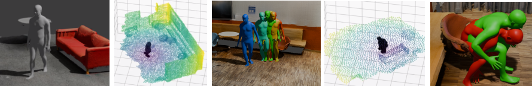

# iDART: Synthesizing Interactive Human Behavior

Course group project for *Digital Humans*, **263-5806-00L**, ETH Zürich, FS2025.

This project aims to integrate [VolumetricSMPL](https://github.com/markomih/VolumetricSMPL) into [DartControl](https://zkf1997.github.io/DART/). The human model achieves a volumetric representation and enables 3D scenes and access to collision loss terms.


## Installation
This section describes the setup and installation for the code of the group project. See the description of DART ([Getting Started](./DART-README.md#getting-started)) for the complete setup. This section is structured into three subsections: Requirements and Environment, Download Project Repository, and Download Data and Model Checkpoints.

### Requirements and Environment

The experimental setup operated on a *conda* (v.25.1.1) environment with *Python* (v.3.12.9) on *Ubuntu* (v.22.04.5). We recommend to use *miniconda* ([Miniconda - ANACONDA](https://www.anaconda.com/docs/getting-started/miniconda/main)). The local device used 2 Intel Xeon CPUs and 1 NVIDIA GTX 1080 Ti from the student cluster. 

```
conda env create -f environment.yml
conda activate iDART
```

### Download Project Repository

Run the following commands in your console. The command will download the project code and activate the external dependencies. 

```
git clone git@github.com:seba-heck/iDART.git
cd iDART
```

#### ⚠️ IMPORTANT
The user need to connect with GitHub SSH (Secure Shell Protocol). For the guideline, see [Generating a new SSH key and adding it to the ssh-agent](https://docs.github.com/en/authentication/connecting-to-github-with-ssh/generating-a-new-ssh-key-and-adding-it-to-the-ssh-agent).

### Download Data and Model Checkpoints

The project depends on model checkpoints and data sets from DART and data for the body models. Please follow the links, download the material, unpack and merge it with this repository. 
- [DART data - Google Drive](https://drive.google.com/drive/folders/1vJg3GFVPT6kr6cA0HrQGmiAEBE2dkaps?usp=drive_link): folders can be copied into the root directory.
- [SMPL-X body model](https://download.is.tue.mpg.de/download.php?domain=smplx&sfile=smplx_lockedhead_20230207.zip): insert into data folder (exact structure below)
- [SMPL-H body model](https://download.is.tue.mpg.de/download.php?domain=mano&resume=1&sfile=smplh.tar.xz): insert into smplx folder (exact structure below)

<details>
  <summary> Root folder structure </summary>

  ```
  .
  ├── config_files
  ├── control
  ├── data             *new
  ├── data_loaders
  ├── data_scripts
  ├── demos
  ├── diffusion
  ├── environment.yml
  ├── evaluation
  ├── misc
  ├── mld
  ├── mld_denoiser    *new
  ├── model
  ├── mvae            *new
  ├── policy_train    *new
  ├── README.md
  ├── scenes
  ├── utils
  └── visualize
  ...
  ``` 
</details>

<details>
  <summary> Data folder structure </summary>

  ```
  data
  ├── action_statistics.json
  ├── fps_dict_all.json
  ├── fps_dict.json
  ├── hml3d_smplh
  │   └── seq_data_zero_male
  ├── inbetween
  │   └── pace_in_circles
  ├── joint_skin_dist.json
  ├── optim_interaction
  │   ├── climb_down.json
  │   └── sit.json
  ├── scenes
  │   └── demo
  ├── seq_data_zero_male
  │   ├── mean_std_h1_f1.pkl
  │   ├── mean_std_h2_f16.pkl
  │   ├── mean_std_h2_f8.pkl
  │   ├── train_text_embedding_dict.pkl
  │   └── val_text_embedding_dict.pkl
  ├── smplx_lockedhead_20230207                        *from other source
  │   └── models_lockedhead                            *unpack and move models here
  ├── stand_20fps.pkl
  ├── stand.pkl
  ├── test_locomotion
  │   ├── demo_walk.json
  │   ├── random.json
  │   ├── test_hop_long.json
  │   ├── test_run_long.json
  │   └── test_walk_long.json
  └── traj_test
      ├── dense_frame180_walk_circle
      ├── dense_frame180_wave_right_hand_circle
      ├── sparse_frame180_walk_square
      └── sparse_punch
  ```
</details>
  
<details>
  <summary> SMPL-X folder structure </summary>

  ```
  data/smplx_lockedhead_20230207/
  └── models_lockedhead
      ├── smplh                     *from MANO/SMPL-H
      │   ├── female
      │   ├── info.txt
      │   ├── LICENSE.txt
      │   ├── male
      │   └── neutral
      └── smplx                     *from SMPL-X
          ├── md5sums.txt
          ├── SMPLX_FEMALE.npz
          ├── SMPLX_MALE.npz
          └── SMPLX_NEUTRAL.npz
  ```
</details>

#### ⚠️ IMPORTANT
Use the correct names for the folders, especially for the SMPl-X folder, and be careful with data folder, it already contains some necessary files.

## Demos
The folder `demos/` contains several scripts which run some examples and experiments. The output motions are saved in `mld_denoiser/mld_fps_clip_repeat_euler/checkpoint_300000/optim/`. These can be visualised with Blender, see [Visualisation - DART](./DART-README.md#visualization). Some examples create a video of the SDF in `bin/results/`. Following are some instructions for the demos.

Examples of different motions and scenes.
```
source demos/examples.sh
```

Experiments with Mesh2SDF and VolSMPL.
```
source demos/mesh2sdf.sh
```

## Guideline

#### ⚠️ IMPORTANT
#### ⚠️ IMPORTANT
#### ⚠️ IMPORTANT
#### ⚠️ IMPORTANT
#### ⚠️ IMPORTANT
#### ⚠️ IMPORTANT
#### ⚠️ IMPORTANT
#### ⚠️ IMPORTANT


## Authors 
- Liza Polupanova, *D-MATH*, ipolupanova@student.ethz.ch
- David Blickenstorfer, *D-MATH*, davidbl@student.ethz.ch 
- Sebastian Heckers, *D-MATH*, sebastian.heckers@inf.ethz.ch 

## Acknowledgment

The authors thanks Kaifeng Zhao for his supervising during the project.

## License
The code was developed at ETH Zurich and is part of the course:
*Digital Humans*, **263-5806-00L**. 
